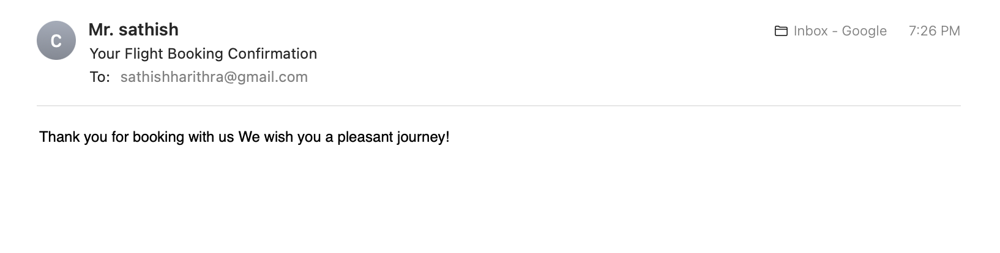

# ✈️ AirBridge – Flight Booking & Employee Management System

**AirBridge** is a full-stack airline reservation and staff management system built using **Java (Spring Boot)**, **JSP**, and **MySQL**. It allows passengers to book flights and admins to manage employees. Upon booking, a **confirmation email** is sent automatically to the passenger's email address. REST APIs are tested with **Postman**.

---

## 🔧 Tech Stack

- **Backend:** Java, Spring Boot
- **Frontend:** JSP (Java Server Pages), JSTL
- **Database:** MySQL
- **Email Integration:** JavaMailSender (Spring Boot)
- **API Testing:** Postman
- **ORM:** Spring Data JPA
- **Build Tool:** Maven
- **Version Control:** Git, GitHub

---

## 🚀 Key Features

### 🧳 Passenger Module
- Book flight tickets via JSP form
- **Send confirmation email** after successful booking ✉️
- View, edit, and delete passenger bookings
- REST APIs for all CRUD operations

### 👩‍💼 Employee Module
- Add, view, edit, and delete employee records
- Admin dashboard using JSP
- REST APIs for employee management

### 📫 Email Notification
- Upon successful flight booking, the user receives a **confirmation email**
- Implemented using **Spring Boot Mail (JavaMailSender)**

---

## 📫 REST API Endpoints (Sample)

| Function            | Endpoint                  | Method |
|---------------------|---------------------------|--------|
| Get All Passengers  | `/api/passengers`         | GET    |
| Add Passenger       | `/api/passengers`         | POST   |
| Update Passenger    | `/api/passengers/{id}`    | PUT    |
| Delete Passenger    | `/api/passengers/{id}`    | DELETE |
| Get All Employees   | `/api/employees`          | GET    |
| Add Employee        | `/api/employees`          | POST   |

---

## 🧪 API Testing with Postman

- All backend APIs were tested using **Postman**
- CRUD operations verified for both modules
- JSON response, error handling, and validation tested
- (Optional) Postman collection available in `/postman/`

---

## 📸 Screenshots

### ✈ Passenger Booking 


### 📧 Email Confirmation 


###  Employee Management 


###  Passenger List 


###  Employee List 


---

## 🛠️ How to Run Locally

1. **Clone the Repository**
   ```bash
   git clone https://github.com/sathishharithra/AirBridge.git
   cd AirBridge
